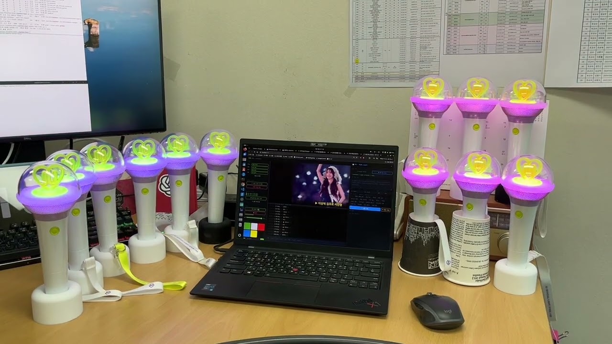
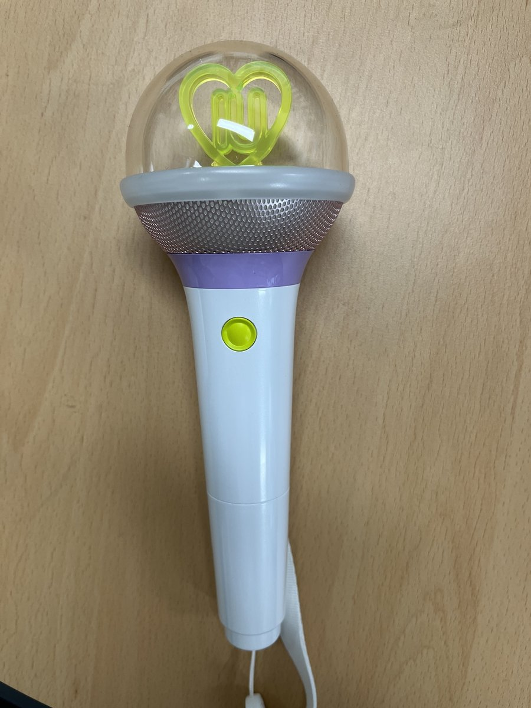

# 🎵 MLML — Music-to-Light Markup Language

[한국어](README.ko.md) | **English**

> An open specification for music-synchronized K-pop lightstick choreography —
> a YAML-based declarative intermediate representation language for translating
> music structure and emotion into real-time color control for BLE / Wi-Fi / Zigbee
> lighting devices (Spec v1.3)

[-purple)](#research)
[](https://youtu.be/a4oUMooHqgo)
[](LICENSE)

**Data Networks Lab, Chungnam National University** · [networks.cnu.ac.kr](https://networks.cnu.ac.kr)

---

## Demo — 12 Lightsticks Synchronized (ACM MM 2026 Paper Demo)

[](https://youtu.be/a4oUMooHqgo)

*12 IU "I Stan U" (관객이 될게) lightsticks synchronized in real-time using the MLML
player — the demo shown in the ACM MM 2026 Interactive Art paper. A larger-scale
16-lightstick demo is also available below under [Demo Videos](#demo-videos).*

---

## What is MLML?

**MLML (Music-to-Light Markup Language)** is a YAML-based open specification that maps
music structure and emotion to lightstick lighting events — automatically.

- Today, K-pop concert lightstick lighting is controlled centrally over wireless RF by the
  entertainment agency's server.
- This research aims to let fans synchronize a small number of lightsticks (roughly 10-20)
  directly with music themselves, at home or at small fan gatherings.
- We propose and develop MLML as an open alternative for creating and sharing
  music-synchronized lighting scenarios.

### Key Features

- 🎵 Automatic music analysis (beat, section, mood, lyric sentiment)
- 💡 Hardware-independent — the same script drives lightsticks, LED strips, Philips Hue, matrix panels
- 📝 Human-readable, declarative YAML scenario format (4-layer structure)
- 🤖 LLM-assisted scenario generation (single-inference full script from Claude, etc.)
- 🎮 Real-time synchronization (≤100ms latency)

---

## 4-Layer Structure

| Layer | Blocks | Role |
|---|---|---|
| Global | `metadata`, `palette`, `global_mood`, `global_arc` | Song-wide settings |
| Structural | `timeline`, `section_defaults`, `bookend`, `expectation_break` | Section structure |
| Rhythmic | `beat_reactive`, `bass_track`, `color_cycle`, `spotlight` | Rhythm response |
| Semantic | `lyric_map`, `spatial`, `motifs` | Emotion & spatial layout |

The full block specification, the 13-step color composition algorithm (50fps), the 28
effects (16 single-device + 12 spatial), and the 9 automatic evaluation metrics
(EIC/SAS/TA/KFA/BBC/CCR/CS/EBS/LCC) are documented in [`SPEC.md`](SPEC.md).

---

## Supported Lightsticks (protocol families analyzed)

| 사진 | 아티스트 | 응원봉명 | 기획사 | 데모 영상 | 
|---|---|---|---|---|
|  | IU (아이유) | I-KE OFL V3 | EDAM Ent. | [▶ YouTube](https://youtu.be/a4oUMooHqgo)|

> In April 2026 when we prepared the paper submission for ACM MM 2026, we have analyzed a single lightstick BLE protoocol (IKE).
> As of Aug. 2026, we're working on a lot of K-pop lightsticks to analyze their BLE protocols.
> The BLE reverse-engineering protocols and reference codes will be
> released in a separate repository after the companion systems paper has completed
> peer review.

---

## MLML Scenario Example

```yaml
metadata:
  title: I Stan U
  artist: IU
  bpm: 161.5
  key: G_major

timeline:
- {t: 0.0,   group: 0, color: neutral,   effect: breath,            intensity: 0.32, period: 4.0, note: intro #1}
- {t: 8.99,  group: 0, color: peak,      effect: flash_all,         intensity: 0.65, note: energy surge}
- {t: 12.14, group: 0, color: secondary, effect: tension_build,     intensity: 0.96, note: prechorus #1}
- {t: 23.92, group: 0, color: null,      effect: expectation_break, intensity: 0.0,  note: blackout (end of pre-chorus)}
```

Every event carries a `note` field recording *why* the compiler placed it — the section
label, the detected kick strength, or the energy transition that triggered it. Authorial
intent stays legible in the artifact itself.

The full example is at [`examples/iu_istanu.mlml`](examples/iu_istanu.mlml): **135 timeline
events** covering 23 of the 28 effects, compiled from a 247.7 s track.

```bash
# Reproduce the example (LLM refinement disabled for determinism)
python mp3_to_mlml.py istanu.mp3 --no-llm
```

> Only `metadata.title` / `artist` / `genre` were corrected by hand; everything else is
> compiler output. Generated scripts contain no lyrics — `lyric_map` carries emotion
> labels and timings only.

---

## Compiler

`mp3_to_mlml.py` is the reference implementation used for the paper: it analyses an
audio file and emits an MLML v1.3 script.

```bash
pip install -r requirements.txt
python mp3_to_mlml.py song.mp3 --no-llm
```

| Flag | Effect |
|---|---|
| `--no-llm` | Skip the LLM pass. **Required for reproducible output** — refinement is non-deterministic. |
| `--srt song.srt` | Derive lighting cues from lyric timings. |
| `--include-lyric-text` | Embed raw lyric lines. **Off by default** — lyrics are usually copyrighted, so generated scripts are safe to redistribute unless you pass this. |
| `--no-demucs` | Skip source separation (faster, less accurate). |
| `--llm-model` | Override the refinement model name. |

`madmom` and `demucs` are optional and the pipeline falls back to librosa without them.
Because that changes beat detection, every script records which path ran:

```yaml
metadata:
  analysis_meta:
    beat_source: madmom     # or: librosa
    bpm_confidence: 0.87
```

---

## Demo Videos

| Song | Lightsticks | Link |
|------|-------------|------|
| IU - I Stan U (관객이 될게) — ACM MM 2026 paper demo | 12 | [▶ YouTube](https://youtu.be/a4oUMooHqgo) |
| Bigbang - Sunset | 12 | [▶ YouTube](https://youtu.be/cPKkz_UI0TA) |
| IU - I Stan U (관객이 될게) — larger-scale follow-up | 16 | [▶ YouTube](https://youtu.be/4xf9s3fa-oU) |
| IU - Blueming | 16 | [▶ YouTube](https://youtu.be/KHmO7usMysU) |
| IU - Shopper | 16 | [▶ YouTube](https://youtu.be/DDSjNIcno14) |
| Aespa - Supernova | 16 | [▶ YouTube](https://youtu.be/a_pUyoQBCkE) |
| Michael Jackson - Billie Jean | 16 | [▶ YouTube](https://youtu.be/BQ4oGPVca64) |

---

## Version History

| Version | Key additions |
|---|---|
| v1.0 | 4-layer structure, 16 single-device effects, 12 spatial effects, EIC/SAS/TA |
| v1.1 | `beat_reactive.on_kick`, `bass_track`, `color_cycle`, KFA/BBC/CCR |
| v1.2 | `global_mood`, `section_defaults`, `expectation_break`, `bookend`, `lyric_map`, `spotlight`, CS/EBS/LCC |
| v1.3 | `lyric_map` SRT auto-parsing + 8-emotion dictionary, `mp3_to_mlml` 4-stage pipeline, LCC metric |

---

## Research

This project is part of ongoing research at
**[Data Networks Lab](https://networks.cnu.ac.kr)**,
**Chungnam National University, Dept. of Computer Engineering & Artificial Intelligence**

- 📄 **"MLML: An Open Music-to-Light Markup Language for Democratizing Fan Lightstick
  Choreography"** — accepted, **ACM Multimedia 2026, Interactive Art Track**
  (Rio de Janeiro, Nov 10–14, 2026) · [10.1145/3767308.3838318](https://doi.org/10.1145/3767308.3838318)
- 🔬 Full specification released here; BLE control reference code releasing after the
  companion systems paper is decided

### Citation

```bibtex
@inproceedings{mlml2026,
  title={MLML: An Open Music-to-Light Markup Language
         for Democratizing Fan Lightstick Choreography},
  author={Lee, Youngseok and Jin, Minhyuk},
  booktitle={ACM Multimedia 2026, Interactive Art Track},
  year={2026},
  doi={10.1145/3767308.3838318}
}
```

See [`CITATION.cff`](CITATION.cff) for the machine-readable version.

---

## Roadmap

- [x] BLE protocol analysis (IU, Blackpink, NMIXX)
- [x] MLML v1.3 specification
- [x] Real-time player (16 lightsticks)
- [x] LLM-based scenario generation
- [x] ACM MM 2026 demo video
- [x] MLML compiler (`mp3_to_mlml.py`) released
- [ ] BLE control reference code (after companion paper decision)
- [ ] MLML Hub (community sharing platform)
- [ ] Web-based editor
- [ ] Mobile app
- [ ] Open SDK release

---

## Contact & Collaboration

For research collaboration or partnership inquiries:
📧 lee@cnu.ac.kr
🏫 Data Networks Lab, Chungnam National University

⭐ **Star this repo** to get notified when the full reference code is released!

## License

This specification and its documentation are released under the [Apache License 2.0](LICENSE).
